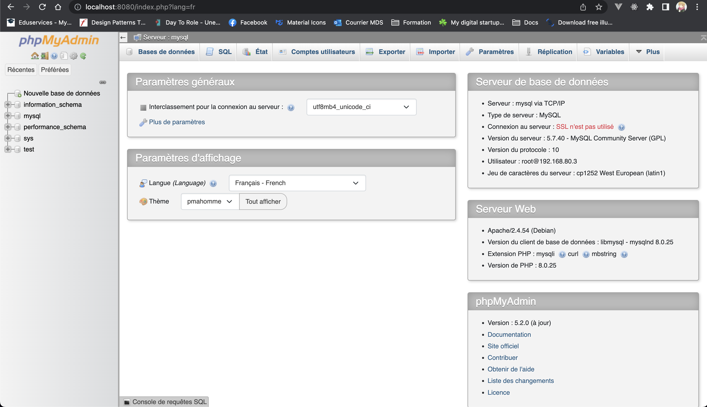

# Exo docker-compose

Mettre en place un LAMP docker-compose à partir des containers suivants :
PHP, Mysql, linux, phpmyadmin

## Documentation

Cet documentation aura pour but de décrire le projet ainsi que le fonctionnement du fichier 

```bash
docker-compose.yml
```

## Installation

Installer le projet en faisant les commandes suivantes :

Clone du projet

```bash
git clone https://github.com/Mok-Mokthar/exo-docker-compose.git
```

Démarrer le docker-compose

```bash
docker-compose up
```

Pour vérifier que PHP fonctionne il faut ouvrir un onglet dans le navigateur est écrire localhost dans l'url.

Normalement vous devez avoir cet onglet :


Ensuite pour vérifier que le phpmyadmin fonctionne il faut inscrire dans l'url localhost:8080.

Normalement vous devez avoir cet onglet :



## docker-compose.yml

```bash
# Permet d'indiquer à Docker Compose quelle version on souhaite utiliser

version: '3'
```

```bash
# L'ensemble de nos containers vont se trouver sous l'argument services. Ici nous avons 3 containers

services: 
    mysql:
    phpmyadmin:
    php:
```
### description services

```bash
mysql:
    # platform linux permet d'éviter les problèmes avec les processeurs arm
    platform: linux/x86_64

    # défini l'image docker à utiliser
    image: mysql:5.7

    # nommage du container
    container_name: mysql

    #volumes va permettre de stocker l'ensemble du contenu du dossier en local ici /var/lib/mysql correspond à l'emplacement par défaut du stockage de base de donnée mysql
    volumes:
      - mysql_data:/var/lib/mysql

    # d'environnement permet d'utiliser/de définir des variables d'environnement
    environment:
      MYSQL_ROOT_PASSWORD: root

    # Exposer un port de notre machine hôte vers notre conteneur : ici ce port correspond au port par défaut de MYSQL
    ports:
      - '3306:3306' 
```

```bash
phpmyadmin:
    # défini l'image docker à utiliser
    image: phpmyadmin

    #depends_on permet d'indiquer l'ordre/la dépendance(des containers les un aux autres) dans lequels les services doivent démarrer/s'arrêter
    depends_on:
      - mysql

    # nommage du container
    container_name: pma

    # d'environnement permet d'utiliser/de définir des variables d'environnement
    environment:
      - PMA_HOST=mysql
      - MYSQL_ROOT_PASSWORD=root
      - PMA_USER=root
      - PMA_PASSWORD=root

    # Exposer un port de notre machine hôte vers notre conteneur : ici ce port correspond au port par défaut du TCP
    ports:
      - '8080:80'
```

```bash
web:
    # défini l'image docker à utiliser
    image: php:7.2.2-apache

    # nommage du container
    container_name: php_web

    # #depends_on permet d'indiquer l'ordre/la dépendance(des containers les un aux autres) dans lequels les services doivent démarrer/s'arrêter
    depends_on:
      - mysql

    # volumes va permettre de stocker l'ensemble du contenu du dossier en local ici : /var/www/html est le dossier par défaut du serveur web
    volumes:
      - ./php/:/var/www/html

    # défini l'image docker à utiliser
    ports:
      - "80:80"

    # L'option stdin_open est utilisée pour ouvrir stdin (entrée standard) dans le conteneur. Cela nous permet d'envoyer des entrées au conteneur via le terminal.
    stdin_open: true

    # Tty permet d'avoir le terminal toujours actif comme un docker -t
    tty: true
```

```bash
#défini un volume docker qui peut être utiliser par plusieurs container. Ici mysql_data est utilisé dans le service mysql
volumes:
  mysql_data :
```


## Support

Un problème ? Email à antoine.chambrin@my-digital-school.org